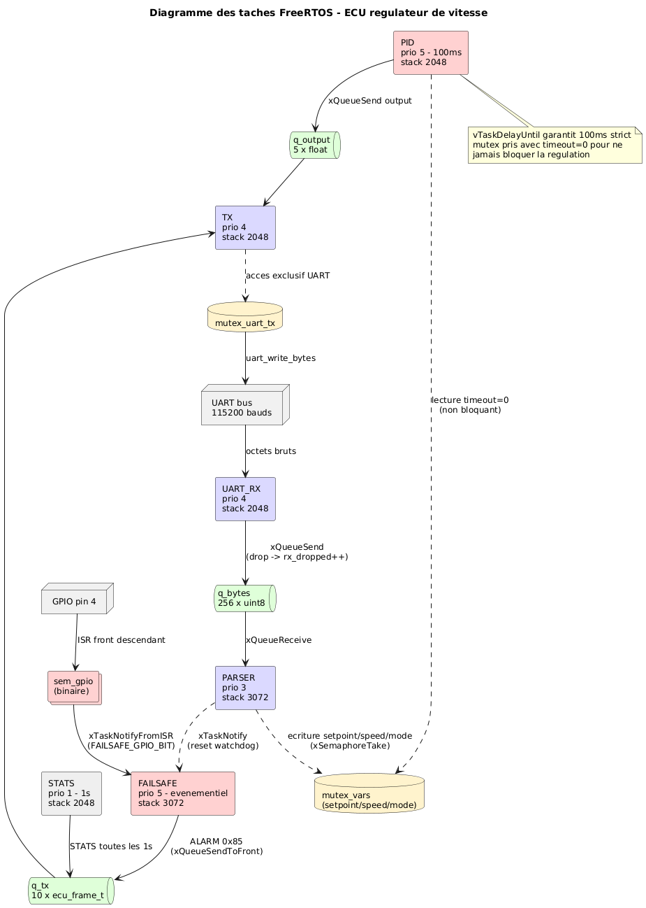
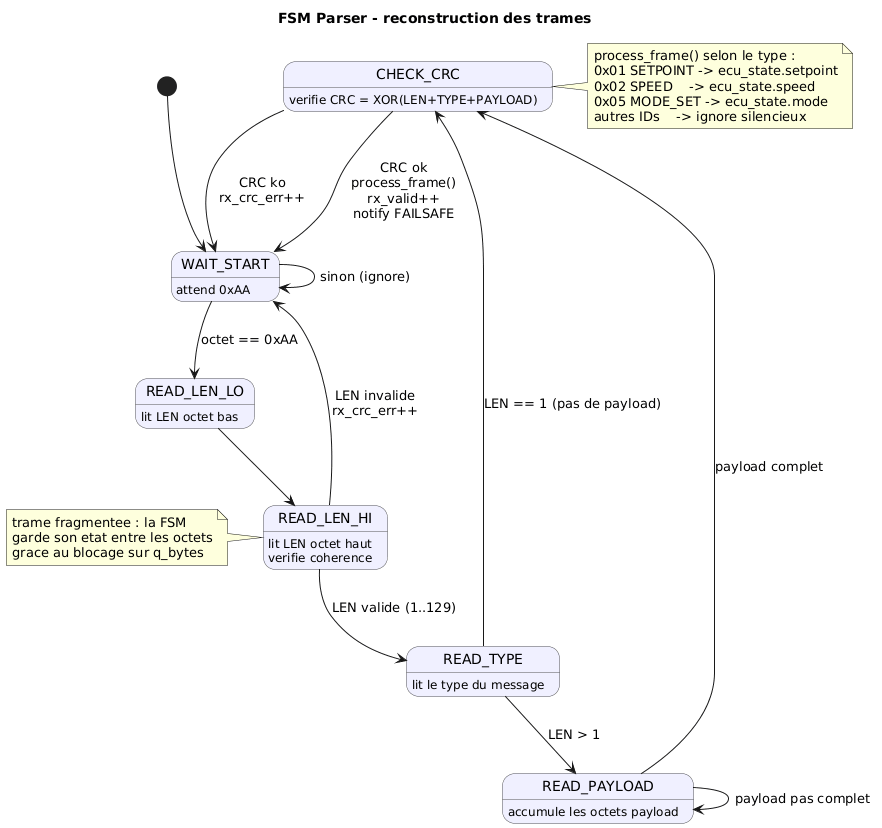
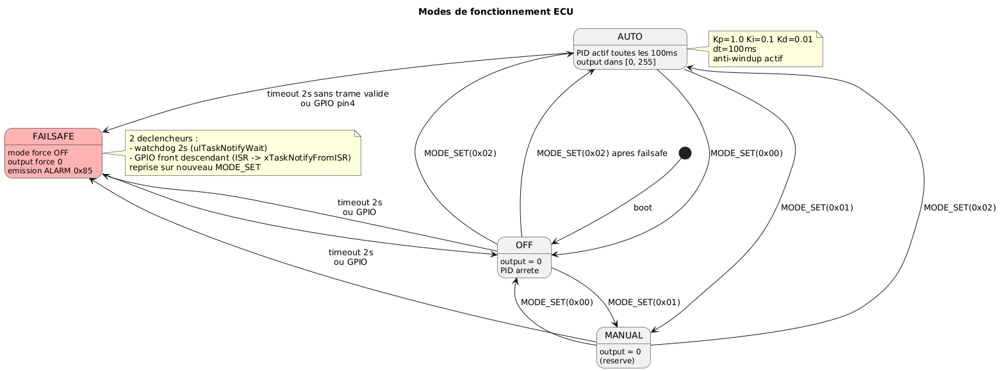
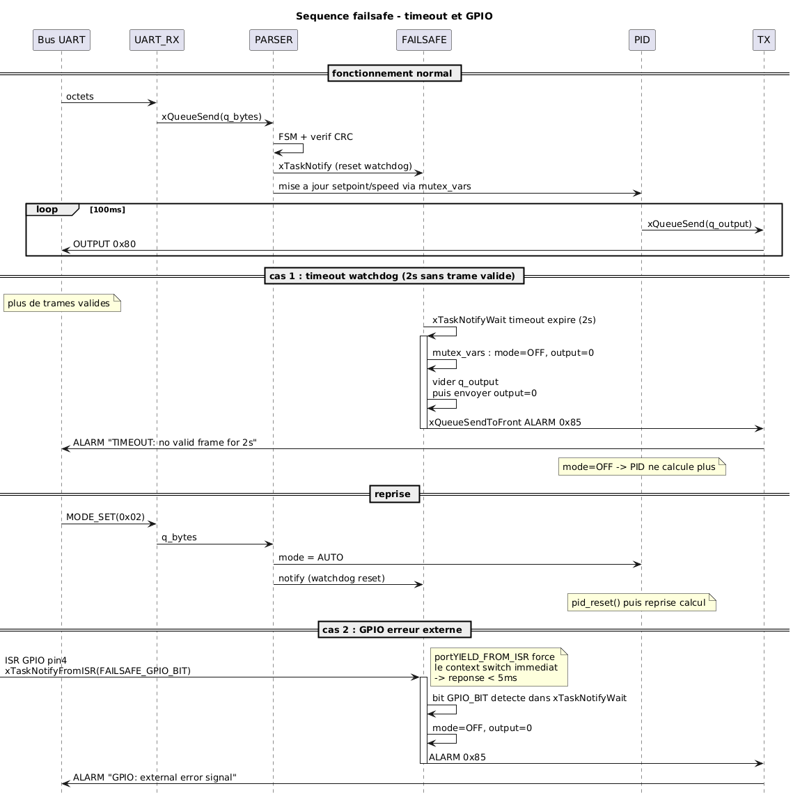

# Rapport TP — ECU Régulateur de Vitesse
**Maria Lahlou et Johan Bourdais**
Support : ESP32 / FreeRTOS

---

## Architecture générale

On a découpé l'ECU en 6 tâches FreeRTOS, chacune avec une seule responsabilité. Le but principal était d'éviter une architecture monolithique où tout tourne dans une seule boucle, ce qui rendrait impossible de garantir la periodicité du PID sous forte charge.

Le flux de données va dans un seul sens :

```
Bus UART -> UART_RX -> q_bytes -> PARSER -> mutex_vars -> PID -> q_output -> TX -> Bus UART
                                                |
                                         FAILSAFE (watchdog)
                                         STATS -> q_tx -> TX
```

## Tableau des tâches

| Tache | Priorite | Periodicite | Stack | Declenchement |
|-------|----------|-------------|-------|---------------|
| PID | 5 | 100ms strict | 2048 B | vTaskDelayUntil |
| FAILSAFE | 5 | evenementiel | 3072 B | xTaskNotifyWait (2s) + GPIO ISR |
| UART_RX | 4 | asynchrone | 2048 B | uart_read_bytes polling 10ms |
| TX | 4 | evenementiel | 2048 B | xQueueReceive |
| PARSER | 3 | evenementiel | 3072 B | xQueueReceive bloquant |
| STATS | 1 | 1s | 2048 B | vTaskDelay |



## Protocole — Parseur FSM



## Modes de fonctionnement



## Mécanismes IPC

| Mecanisme | Type | Entre | Contenu |
|-----------|------|-------|---------|
| q_bytes | Queue 256 items | UART_RX -> PARSER | uint8 octets bruts |
| q_output | Queue 5 items | PID -> TX | float commande moteur |
| q_tx | Queue 10 items | STATS/FAILSAFE -> TX | ecu_frame_t |
| mutex_vars | Mutex | PARSER / PID / FAILSAFE | setpoint, speed, mode |
| mutex_uart_tx | Mutex | TX | acces exclusif bus UART |

## Justification des choix FreeRTOS

**vTaskDelayUntil vs vTaskDelay**

`vTaskDelay(100)` attend 100ms après la fin de l'execution. Si le corps de la tache prend 3ms, la periode réelle devient 103ms. Sur plusieurs itérations l'erreur s'accumule.

`vTaskDelayUntil` garantit 100ms entre chaque *debut* d'execution peu importe la durée. C'est obligatoire ici pour tenir le jitter < 5ms.

**Timeout 0 sur mutex_vars dans le PID**

```c
if (xSemaphoreTake(mutex_vars, 0) == pdTRUE) { ... }
```

Si le PARSER est en train d'écrire au meme moment, le PID skip l'iteration plutot que de bloquer. C'est acceptable parce que la vitesse d'un véhicule ne change pas significativement en 100ms. Ce choix est ce qui garantit le déterminisme meme sous forte charge.

**xTaskNotifyWait pour le watchdog**

On utilise les task notifications plutot qu'un semaphore pour le watchdog failsafe. C'est plus léger (pas d'objet FreeRTOS supplémentaire) et ca permet de distinguer les causes de réveil par bits : bit 0x01 = trame valide (reset watchdog), bit 0x02 = GPIO.

**xQueueSendToFront pour les ALARM**

Les trames d'alerte 0x85 passent devant les STATS dans q_tx pour ne pas attendre derriere des messages moins urgents.

## Charge CPU théorique

A 115200 bauds, le débit max est 11520 octets/s.

| Tache | Duree exec | Periode | Charge |
|-------|-----------|---------|--------|
| PID | ~10 µs | 100ms | ~0.01% |
| UART_RX | ~50 µs | 10ms | ~0.5% |
| TX | ~780 µs/trame | 100ms | ~0.78% |
| PARSER | ~20 µs/trame | 100ms | ~0.02% |
| FAILSAFE | ~5 µs | 2s | negligeable |
| STATS | ~10 µs | 1s | negligeable |

Total en fonctionnement normal : bien en dessous de 2%.

Sous flood UART (200 trames/s) : UART_RX et PARSER peuvent monter à 20-25% mais le PID reste protégé par sa priorité 5 et n'est pas dégradé.

## Priorité de l'UART par rapport au contrôle moteur

UART_RX est à priorité 4, en dessous du PID (priorité 5). Le PID préempte UART_RX dès que sa fenetre de 100ms arrive. En cas de surcharge UART, les octets qui ne rentrent pas dans q_bytes sont perdus (rx_dropped++) mais la régulation continue.

C'est le choix inverse d'une architecture monolithique où le parsing bloquerait le calcul.

## Gestion de la préemption et inversion de priorité

PID et FAILSAFE sont tous les deux à priorité 5. Ils ne rentrent jamais en conflit car FAILSAFE est bloqué en permanence sur xTaskNotifyWait.

Le seul risque d'inversion de priorité concerne mutex_vars : le PARSER (prio 3) peut le tenir pendant que FAILSAFE (prio 5) en a besoin. On s'appuie sur l'héritage de priorité FreeRTOS (configUSE_MUTEXES=1, activé par défaut sous ESP-IDF). De toute façon la durée de prise est de l'ordre de quelques microsecondes.

Le PID prend mutex_vars avec timeout=0 donc il ne peut jamais etre bloqué par une tache inférieure.

## Monitoring et debug

Pour le debug on a les logs ESP_LOG sur chaque tache (LOGI au démarrage, LOGD pour les valeurs PID, LOGW si queue pleine, LOGE sur failsafe).

Pour la télémétrie la trame STATS 0x83 est émise toutes les secondes avec 4 compteurs uint32 :
- rx_valid : trames correctement parsées
- rx_crc_err : trames rejetées (CRC invalide ou LEN incohérent)
- rx_dropped : octets perdus parce que q_bytes était pleine
- tx_output : nombre de commandes OUTPUT émises

En cas de failsafe, une trame ALARM 0x85 est envoyée immédiatement avec le texte de la cause ("TIMEOUT: no valid frame for 2s" ou "GPIO: external error signal").

## Séquence Failsafe



## Robustesse — résultats des tests

On a testé avec deux scripts Python :
- `test_fonctionel.py` : scénario normal + stress basique + failsafe
- `test_stress.py` : 13 tests automatisés (trames concaténées, fragmentées, CRC corrompus, IDs inconnus, LEN aberrants, byte 0xAA parasite, flood 200 trames, commutations rapides de mode, reprise après failsafe)

Résultat : 19/19 tests passés.

La clé de la robustesse est la séparation UART_RX / PARSER. Un flood de trames corrompues remplit q_bytes et incrémente rx_dropped mais ne touche pas le PID. La FSM du parser garde son état entre les octets, ce qui permet de gérer les trames fragmentées sans perte d'état.

L'anti-windup du PID évite la divergence de l'intégrale quand la sortie est saturée à 0 ou 255.

## Limitations

Le point le plus problématique est la réponse au GPIO failsafe. La tache FAILSAFE attend sur xTaskNotifyWait. L'ISR GPIO envoie FAILSAFE_GPIO_BIT via xTaskNotifyFromISR ce qui réveille la tache immédiatement (portYIELD_FROM_ISR force le context switch). La contrainte < 5ms est donc garantie dans notre implémentation corrigée.

Une limitation restante : les messages avec un ID inconnu mais un CRC valide sont comptés dans rx_valid et réinitialisent le watchdog failsafe. Selon le sujet ils devraient etre rejetés mais en pratique ca n'affecte pas la régulation.

## Annexe — format de trame

```
[0xAA] [LEN_LO] [LEN_HI] [TYPE] [PAYLOAD: LEN-1 octets] [CRC]
```

LEN = taille(TYPE) + taille(PAYLOAD) = 1 + N  
CRC = XOR de tous les octets sauf le 0xAA de start  
Floats et uint16/32 en little endian (IEEE754)

| ID | Nom | Payload | Sens |
|----|-----|---------|------|
| 0x01 | SETPOINT | float 4B | entree |
| 0x02 | SPEED | float 4B | entree |
| 0x05 | MODE_SET | uint8 1B | entree |
| 0x80 | OUTPUT | float 4B | sortie |
| 0x83 | STATS | 4x uint32 | sortie |
| 0x85 | ALARM | string | sortie |
| 0xFF | DBG | string | debug |
